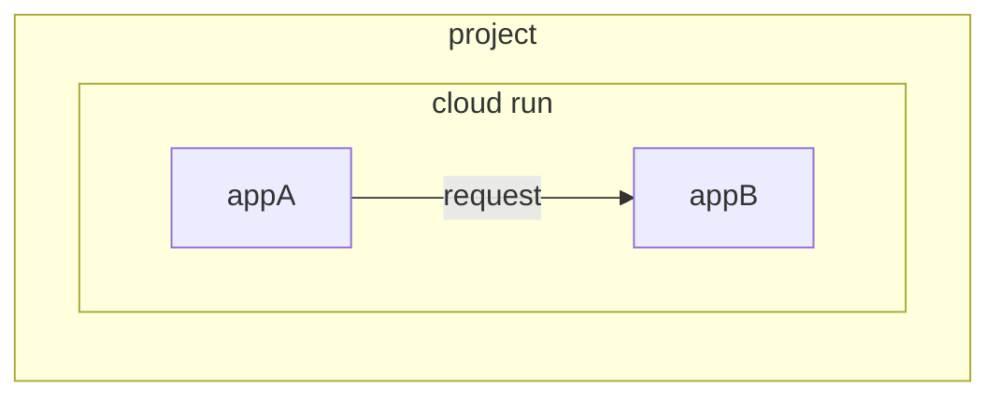

## この記事は
CloudRunに2つのアプリケーションがあり(`appA`, `appB`)、`appA`から`appB`へリクエストする場合の方法を説明します。
なお、以下に示すとおり同一プロジェクト内の2つのCloudRunアプリケーションを例に取ります。


## 認証
呼び出されるアプリ側(`appB`)で、呼び出し元(`appA`)のIAMサービスアカウントに対してCloudRun実行元の権限を付与します。
コンソールから実施する場合は以下のようになります。

## トークン設定
呼び出し元のアプリ（`appA`）ではリクエストのヘッダにトークンを設定します。
```kotlin
    override fun getData(userId: UserId): ApiResponse.Response {

        val url = "${url}?userId=${userId.value}"

        // トークンを取得する
        val credential = GoogleCredentials.getApplicationDefault()
        val tokenCredential = IdTokenCredentials.newBuilder()
            .setIdTokenProvider((credential as IdTokenProvider))
            .setTargetAudience(config.url)
            .build()

        tokenCredential.refreshIfExpired()
        val accessToken = tokenCredential.accessToken.tokenValue

        // ヘッダにトークンを設定する
        val headers = HttpHeaders()
        headers.setBearerAuth(accessToken)

        val entity = HttpEntity(null, headers)

        val restTemplate = RestTemplate()

        return restTemplate.exchange(url, HttpMethod.GET, entity, ApiResponse.Response::class.java).body
            ?: throw RuntimeException("Failed to get response")
    }
```

## 参考
https://cloud.google.com/run/docs/securing/managing-access?hl=ja
https://cloud.google.com/run/docs/authenticating/overview?hl=ja
https://zenn.dev/matken/articles/invoke-auth-required-cloud-run

