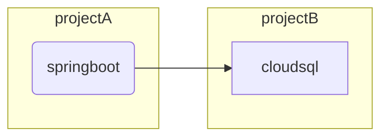
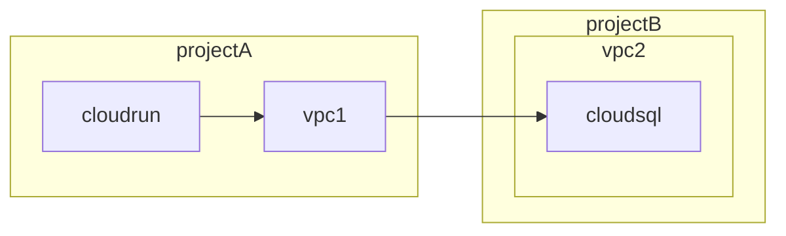

# やること
別プロジェクトに作成されたCloud SQLインスタンスにCloud Runから接続する

概要図は以下の通り。


# 最終的な構成図
別プロジェクトのCloud SQLに接続するには諸々の設定が必要です。以下に最終的に完成する構成図を記載します。


# 手順
それでは、上記の構成図を完成させるために一つずつ実践していきます。

## Cloud SQLインスタンスの作成
VPCアクセスをするため、プライベートIPでの接続とします。また、Postgresを利用することとします。
https://cloud.google.com/sql/docs/mysql/connect-instance-private-ip?hl=ja
ただし、パブリックIPによる接続も許容しておいた方が後々作業がしやすい場面があるのでプライベートIP・パブリックIP共に有効化します。

Cloud Shellを使用して作成したCloud SQLインスタンスへアクセスします。
https://cloud.google.com/sql/docs/postgres/connect-instance-cloud-shell?hl=ja

また、適当なデータベースも作成します。今回は`test-db`とします。

## Cloud Run
Cloud SQLへ接続するアプリケーションを設定します。今回は`Spring Boot`を使用して単純なデータベースアクセスのみを実行するアプリケーションを作成します。

```
$ gcloud builds submit --tag gcr.io/dummy-app/dummy-app .
$ gcloud run deploy dummy-app --image=gcr.io/dummy-app/dummy-app
```

### VPCアクセスコネクタ
VPCアクセスコネクタを利用して、VPCに接続します。

## VPCネットワークピアリング
https://cloud.google.com/vpc/docs/vpc-peering?hl=ja
上記までで、Cloud SQLとCloud Run双方のプロジェクトにそれぞれVPCが作成された状態になっています。
ここで、両者のVPCを繋ぐため、VPCピアリングを設定します。

# 参考
https://cloud.google.com/sql/docs/mysql/connect-run?hl=ja#public-ip-default
https://blog.g-gen.co.jp/entry/vpc-explained-basics
https://blog.g-gen.co.jp/entry/vpc-explained-advanced
https://cloud.google.com/vpc/docs/vpc-peering?hl=ja
https://www.getto.systems/entry/2021/07/09/162314
https://note.com/pharmax/n/nd982ee869d93
https://cloud.google.com/vpc/docs/configure-private-services-access?hl=ja
https://cloud.google.com/vpc/docs/using-vpc-peering?hl=ja#example-setup
https://cloud.google.com/vpc/docs/private-google-access?hl=ja
https://zenn.dev/google_cloud_jp/articles/38a4d401806b3a
https://community.c2cglobal.com/infrastructure-122/how-can-i-access-the-cloud-sql-with-private-ip-only-from-another-project-vpc-953