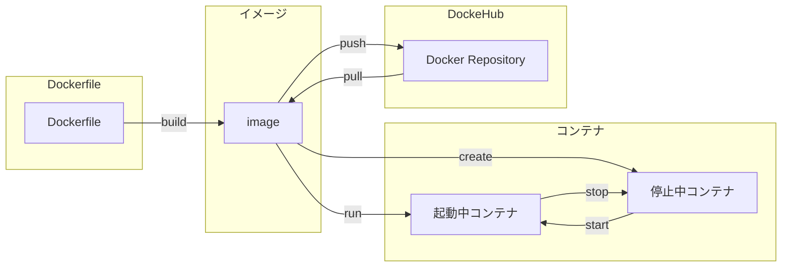

# はじめに
Dockerのコマンドの種類とそれらを実行したときの結果の一覧が欲しかったため、作成しました。
各コマンドの解説も後述します。



# 各種コマンド解説
## build
`Dockerfile`をもとにイメージを作成します。
例
```shell
$ docker build .
```

### オプションなど
#### -t

#### -f

## push
例
```shell
$ docker build -t 
```

## pull
例
```shell
$ docker build -t 
```

## create
例
```shell
$ docker build -t 
```

## run
例
```shell
$ docker run image
```
`docker run`は、前述した`docker create`と`docker start`を実行することと同じです。

## stop
例
```shell
$ docker build -t 
```

## start
例
```shell
$ docker build -t 
```