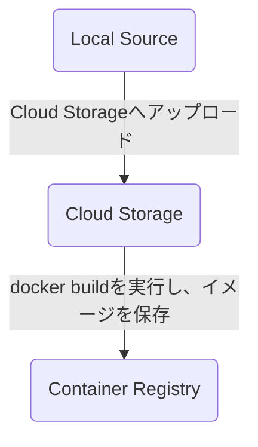

# この記事は
`gcloud`コマンドの一つである`gcloud builds submit`コマンドを使用してローカルにあるソースをビルドします。
最終的にCloud Runにデプロイすることを目標にします。

記事の内容としては、初めにCloud Buildおよび`gcloud builds submit`について大まかに説明し、後半で実際に`gcloud builds submit`を実施してGCPへイメージのpushおよびCloud Runへのデプロイを行います。
(Cloud Runへのデプロイは直接`gcloud builds submit`と関連は薄いですが、pushしたイメージを利用してなにかやりたかったので、実施しています)

# 前提条件
* gcloud cliが利用できること
* GCPに任意のプロジェクトが存在していること

# Cloud Buildについて
`gcloud build submit`を使用する前に、GCPのサービスの一つであるCloud Buildについての理解が必要になるので、かいつまんで説明します。


# gcloud builds submit
`gcloud builds submit`を実行すると以下のような流れでContainer Registryにイメージが保存されます。


上記の流れは、`gcloud builds submit`コマンドの実行ログからもわかります。例としてログの一部を掲載します。
:::details ログ
```
```
:::

:::message
**Container ResistryとArtifact Resistry**
イメージをGCPに保存する場合に、選択肢としてContainer ResistryとArtifact Resistryがあります。
本記事ではContainer Resistryに保存する方法を取りますが、これからCloud Buildを利用する場合は特段の理由がない限りはArtifact Resistryを使用する方が良いでしょう。
Container ResistryとArtifact Resistryの違いについては以下の記事が参考になります。

https://zenn.dev/htr_art/articles/b00cfa9af06d12
:::

# Dockerfile vs cloudbuild.yml
`gcloud builds submit`コマンドを利用する場合、`Dockerfile`のみで実行する場合と、`cloudbuild.yml`を利用した場合の2つの方法があります。筆者の所感では、より複雑なことをするような場合はcloudbuild.ymlを利用する方がベターな選択のように思います。
本記事では最終的に`cloudbuild.yml`を利用した方法を書きますが、ここで一旦それぞれの方法を簡単に紹介します。

## Dockerfileのみの場合
Dockerfileのみで`gcloud builds submit`を行う場合は、以下のようなディレクトリ構成で実行します。
```

```

## cloudbuild.ymlを利用する場合
cloudbuild.ymlを利用する場合は`gcloud builds submit`コマンドのみで実行できます。以下に、cloudbuild.ymlのサンプルを掲載します。


